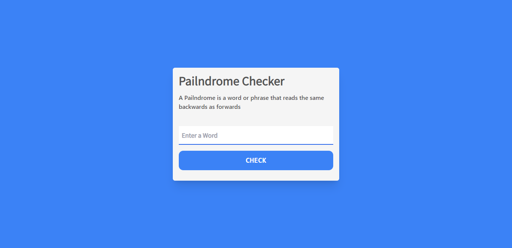

## Pailndrome Checker : ( HTML, Tailwind css and JavaScript)

- A palindrome is a word, number, phrase, or other sequence of characters which reads the same backward as forward, such as madam or racecar.

#### Demo Link : [Go page](https://sm8uti.github.io/Javascript-Projects/Pailndrome%20Checker/pailndrome.html)

### Screenshot : 

