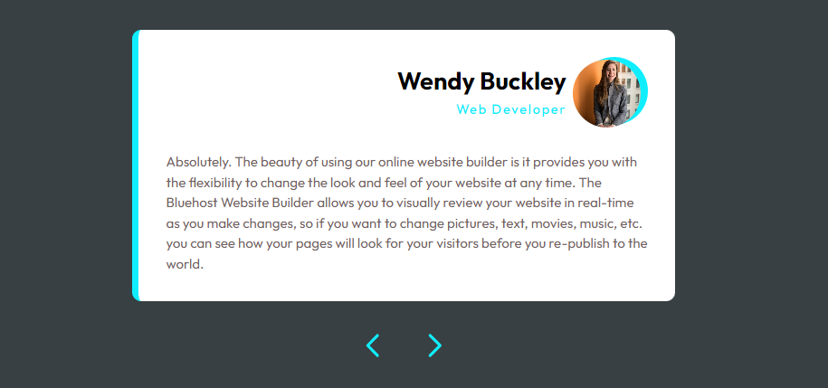
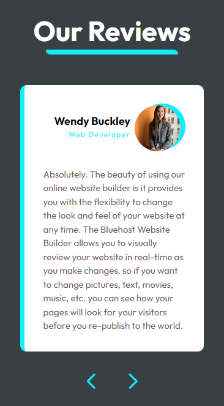

<br/>

<h1>Review Card Section :</h1> 

#### Technologies use : `Html` `Scss` `Javascript`

This is a reviews component section.
<br/>

### Demo : [link](https://sm8uti.github.io/Javascript-Projects/Reviews%20Card/)

<br/>

## 📁 File Structure : 

<br/>

```
|   index.html
|   README.md
|
+---app
|   +---js
|   |       app.js
|   |
|   \---scss
|           main.css
|           main.css.map
|           main.scss
|           _variables.scss
|
\---screenshot
        screenshot-desktop.png
        screenshot-mobile.png
```

<br/>

## 💻 Variables : 
- if you change colors goto [variables.scss](https://sm8uti.github.io/Javascript-Projects/Reviews%20Card/app/scss/_variables.scss) file and change it.

<br/>

```scss
// Font-family :

$outfit:'Outfit',sans-serif;

// Colors : 

$primary:hsl(184, 99%, 53%);
$white:hsl(0, 0%, 100%);
$author:hsla(0, 0%, 0%, 0);
$review:hsl(0, 7%, 41%);
$background:hsl(196, 9%, 24%);
```
## 🔠 Typography :

<br/>

- Font : [Outfit](https://fonts.google.com/specimen/Outfit)

<br/>

```scss
@import url('https://fonts.googleapis.com/css2?family=Outfit:wght@400;500;700&display=swap');
```

## 💬 Reviews : 

<br/>

```javascript
const reviews = [
    {
        id:1,
        name:"Wendy Buckley",
        job:"Web Developer",
        image:'https://images.unsplash.com/photo-1573496359142-b8d87734a5a2?ixlib=rb-1.2.1&ixid=MnwxMjA3fDB8MHxwaG90by1wYWdlfHx8fGVufDB8fHx8&auto=format&fit=crop&w=1376&q=80',
        text:"Absolutely. The beauty of using our online website builder is it provides you with the flexibility to change the look and feel of your website at any time. The Bluehost Website Builder allows you to visually review your website in real-time as you make changes, so if you want to change pictures, text, movies, music, etc. you can see how your pages will look for your visitors before you re-publish to the world."
    },
    {
        id:2,
        name:"Dean Wolf",
        job:"Software Enginner",
        image:'https://images.unsplash.com/photo-1472099645785-5658abf4ff4e?ixlib=rb-1.2.1&ixid=MnwxMjA3fDB8MHxwaG90by1wYWdlfHx8fGVufDB8fHx8&auto=format&fit=crop&w=870&q=80',
        text:"Currently, the Bluehost online website builder comes with a single theme with over 1000 different layout options. We plan to include more theme options soon as well as allow for compatible theme imports."
    },
    {
        id:3,
        name:"Colin Johnston",
        job:"Grapic Designer",
        image:'https://images.unsplash.com/photo-1474176857210-7287d38d27c6?ixlib=rb-1.2.1&ixid=MnwxMjA3fDB8MHxwaG90by1wYWdlfHx8fGVufDB8fHx8&auto=format&fit=crop&w=870&q=80',
        text:"Bluehosts Website Builder is different because it allows the full flexibility of WordPress to remain available, even though we are providing a simplified building experience. As your website and your knowledge of WordPress grows."
    },
    {
        id:4,
        name:"William Estrada",
        job:"Product Manager",
        image:'https://images.unsplash.com/photo-1530268729831-4b0b9e170218?ixlib=rb-1.2.1&ixid=MnwxMjA3fDB8MHxwaG90by1wYWdlfHx8fGVufDB8fHx8&auto=format&fit=crop&w=870&q=80',
        text:"Since the Website Builder is built on top of WordPress, you get to leverage the full power and functionality of WooCommerce such as unlimited products, secure payment gateways and a wide range of WooCommerce addons and plugins to help you build a successful online store."
    }
]
```

<br/>

## 🖥️ ScreenShot (Mobile 📱): 

<br/>


<br/>

<div>
                <h3>©️Copyrights <a href="https://github.com/SM8UTI">🌏 SM8UTI</a>. All Rights Reserved.
           </h3> </div>
